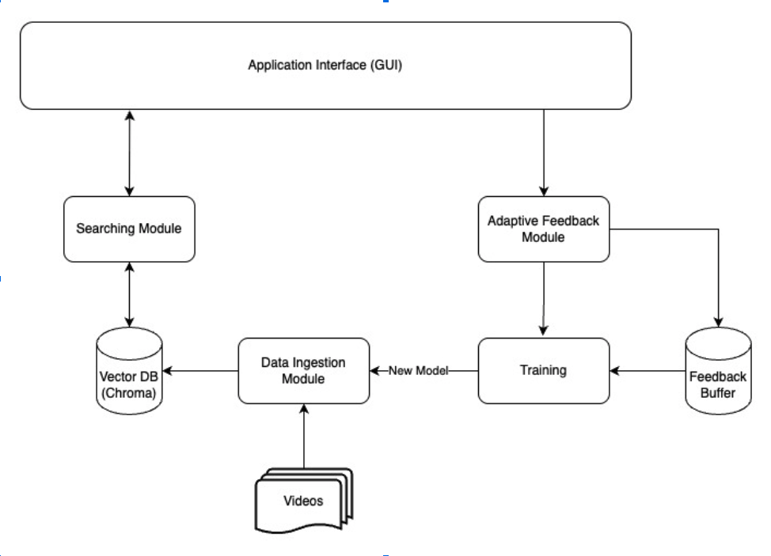
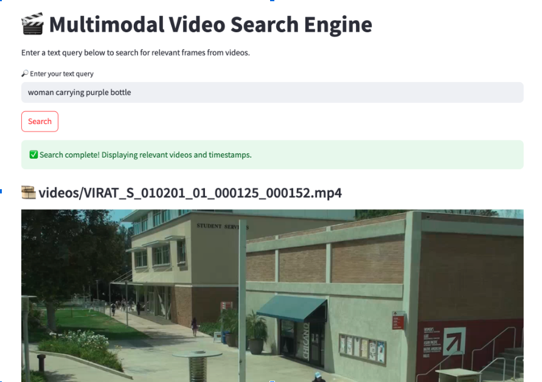
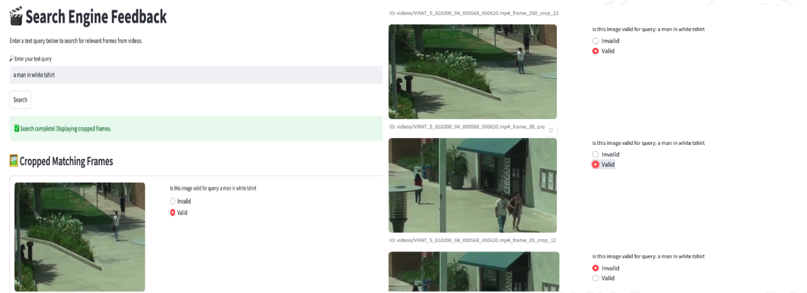

# Large Scale Video Retrieval with Adaptive Feedback

This project addresses the challenge of locating specific objects in large volumes of long-duration video. It leverages modern vision-language models and feedback mechanisms to create a lightweight, adaptive system that scales to real-world surveillance, media analytics, and broadcast monitoring use cases.

---

## Objective

> To build a scalable, accurate, and adaptive video retrieval system that identifies the appearance of a reference object in long videos — overcoming variations in lighting, angle, occlusion, and resolution.

---

## Technologies Used

- Python
- CLIP (ViT-based)
- ChromaDB (Vector DB for semantic indexing)
- OpenCV (video processing)
- Numpy, Matplotlib (for prototype visualization)

---

## System Architecture

**Main Components:**

1. **Frame Extraction:** Extracts frames at intervals or event-based triggers.
2. **Embedding Generation:** Uses CLIP-ViT to embed both query image and frames.
3. **Vector Search:** ChromaDB retrieves semantically similar frames.
4. **Grid-Based Localization:** Improves retrieval accuracy by analyzing spatial consistency.
5. **Human Feedback Loop:** Users validate results to adapt to new conditions.
6. **Adaptive Fine-Tuning:** System adjusts to new camera environments over time.

---

## UI Overview

#### Searching 

   

#### Adapative Feedback

---

## Results & Achievements

- Lightweight & scalable: Works on large corpora of video data
- Intelligent adaptation: Feedback loop fine-tunes search based on environment
- Improved localization: Grid-based method boosts frame matching accuracy
- Accuracy: Significantly reduces manual labor in object search tasks

---

## Example Use Case

| Input                      | Output                                                                |
| -------------------------- | --------------------------------------------------------------------- |
| Query image of red vehicle | Timestamps from 3+ hours of traffic footage where the vehicle appears |
| Surveillance snapshot      | Frames from different angles & lighting matching the subject          |

---

## [Link to Presentation](https://docs.google.com/presentation/d/10cbZF1Vgqmd9tzaVEjZq3Y4TeiXK9SZIPtr-ESccd8I/edit?usp=sharing)
